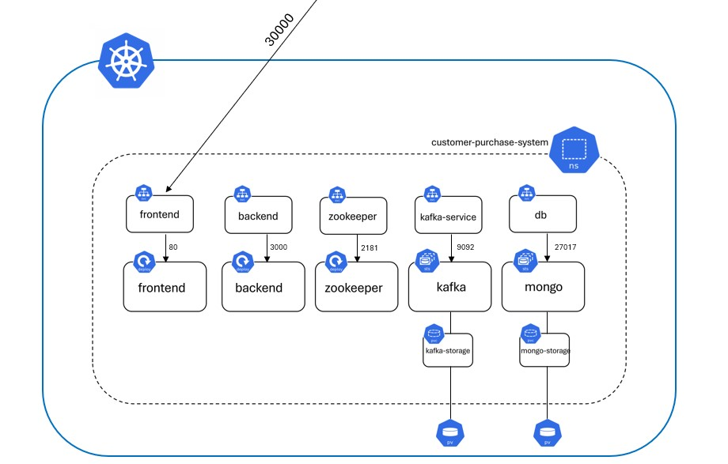

# Customer Purchase System

## Description
The Customer Purchase System is a web application that allows clients to purchase items. 

It provides functionality to retrieve all purchases made by a specific user as well as all purchases made by all users.

## Architecture Diagram


## Prerequisites
- Kubernetes Cluster
## Installation
1. Clone the repository:
    ```sh
    git clone https://github.com/galshirizli/customerPurchaseSystem.git
    ```
2. Make the deployment script executable:
    ```sh
    chmod +x ./customerPurchaseSystem/deploy.sh
    ```
3. Navigate to the project directory::
    ```sh
    cd ./customerPurchaseSystem
    ```
4. Run the deployment script:
    ```sh
    ./deploy.sh
    ```
5. Please note: The deployment process may take up to 10 minutes to complete.

## Access
- Ensure that port 30000 is open.
  - Access the application in your browser at: http://NODE-IP:30000
- Alternatively, you can use port forwarding.
